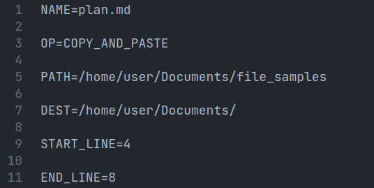

# File Tool

File Tool is a utility which provides a set of instruction which are parsed by another tool and then the operations on files are done.

## Instructions

- `NAME`, Name of the file
- `PATH`, Path of the file
- `DEST`, Destination of the file
- `OP`, Operation on the file
  - `CP`, Copy files
  - `MV`, Move files
  - `COPY_AND_PASTE`, Copy certain lines from source to destination
- `START_LINE`, Starting line number for `COPY_AND_PASTE`
- `END_LINE`, Ending line number for `COPY_AND_PASTE`

## Sample file

